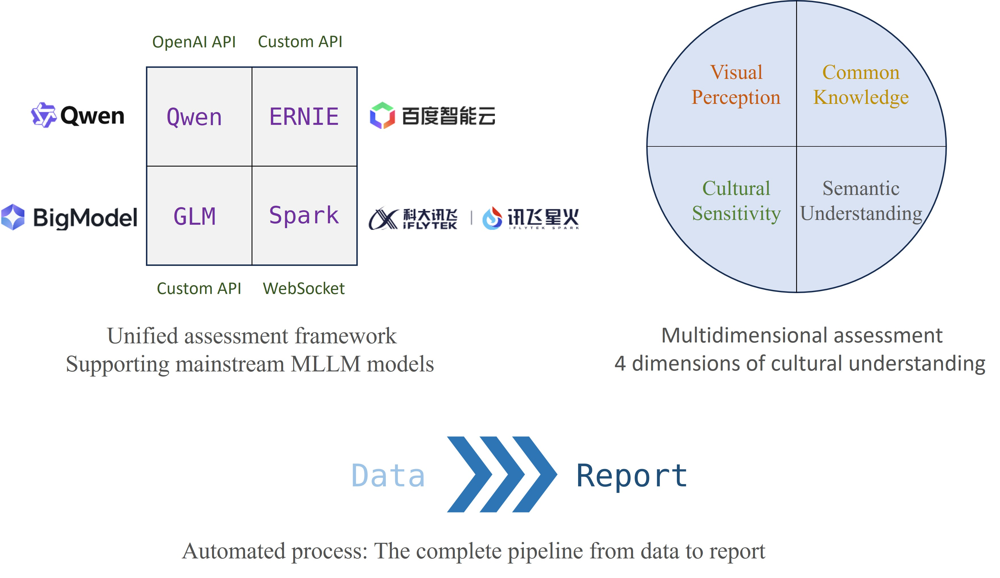
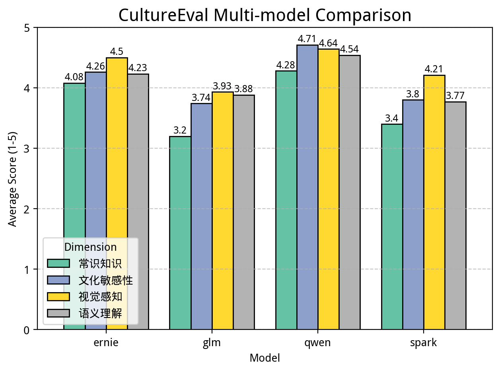
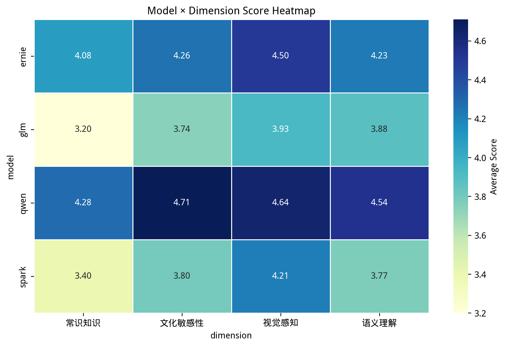
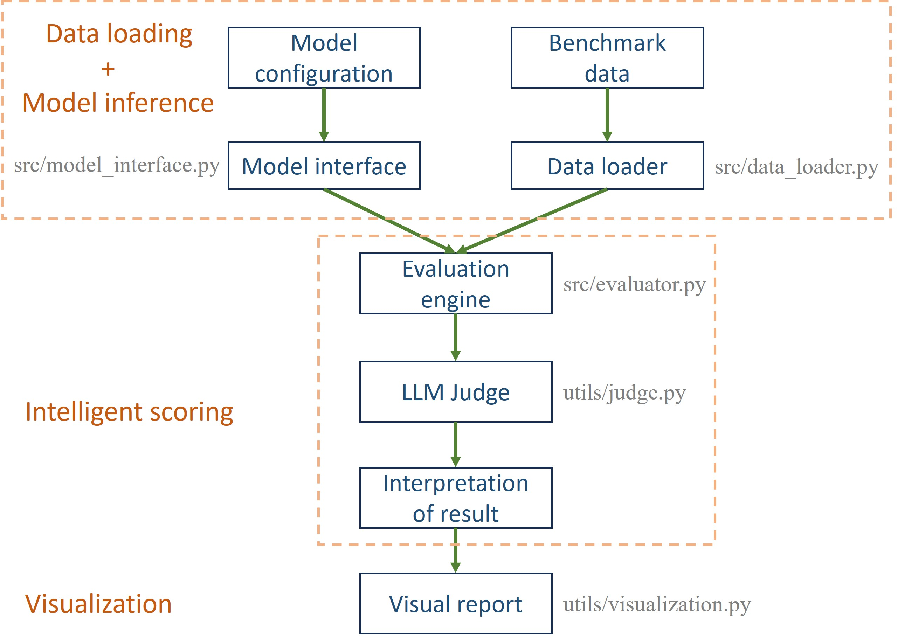

# CultureEval: Chinese Cultural Symbol Recognition MLLM Automated Evaluation Toolkit

**The first automated evaluation tool for multimodal large-scale models focusing on the recognition of Chinese cultural symbols.**


## Project Overview

CultureEval is an automated toolkit focused on evaluating the ability of multimodal large language models (MLLMs) to understand Chinese cultural symbols. Addressing the issue that existing MLLMs are primarily trained on Western cultural data, we have constructed a systematic evaluation framework.

### Core Objectives
- Fill the gaps in the assessment of Chinese cultural understanding.
- Provide a reproducible automated assessment process.
- Support cross-model comparisons.
- Promote research on AI's cultural adaptability.

## Features

### Supported Models

| Model        | Manufacturers | API Protocol      | Features                       |
| :----------: | :-----------: | :---------------: | :----------------------------: |
| Qwen-VL      | Alibaba Cloud | OpenAI compatible | Best cultural sensitivity      |
| ERNIE-VL     | Baidu         | Qianfan API       | Excellent visual perception    |
| GLM-4V       | Zhipu AI      | Zhipu API         | Semantic understanding balance |
| Spark-Vision | iFlytek       | WebSocket         | Fast real-time response        |

### Assessment Dimensions

- **Visual Perception**: Cultural Symbol Recognition, Scene Understanding.

- **Common Sense Knowledge**: Cultural Background, Historical Origins.

- **Semantic Understanding**: Cultural Connotation, Abstract Concepts.

- **Cultural Sensitivity**: Value Alignment, Security Handling.

### Automation Features

- One-click multi-model evaluation.

- Intelligent LLM referee scoring (qwen-plus).

- Visual chart generation.

- Detailed HTML report.

- Export raw JSON data.

## Quick Start

### Environment Setup

```bash
# 1. Cloning repository
git clone https://github.com/elowendeng/CultureEval.git
cd CultureEval

# 2. Creating a virtual environment
conda create -n culture_eval python=3.10 -y
conda activate culture_eval

# 3. Install dependencies
pip3 install torch torchvision
pip install -r requirements.txt

# 4. Configure API key
cp .env.example .env
# Edit the .env file and enter your API key.
```

The command to install PyTorch can be found on the webpage: [Get Started](https://pytorch.org/get-started/locally/). Before that, you need to run the command: `nvcc --version` to check the CUDA version.

### Prepare assessment data

Place your test images in `data/images/` and create `data/culture_bench.json` (refer to the style of `example_benchmark.json`):


```json
[
  {
    "id": "c001",
    "image_path": "data/images/dragon_dance.jpg",
    "question": "What traditional Chinese art is depicted? In which festival is it commonly seen?",
    "dimension": "visual_perception",
    "reference": "Dragon dance, during Spring Festival or Lantern Festival"
  }
]
```

I have also provided my dataset, the link is [Google Drive](https://drive.google.com/drive/folders/1zZFiqERC6m0YUSK0WEnIpxoZ0ho9s213?usp=sharing). You can download the files and place the "images" folder and "culture_bench.json" in the ./data directory.

### Operational assessment

```bash
python main.py
```

## Results Display

After execution, the following results will be generated in the `outputs/` directory:

### 1. Model comparison chart

*Comparison of average scores of each model across different dimensions*

### 2. Heat map

*Model × Dimension Score Distribution Visualization*

### 3. HTML Report
```bash
outputs/report.html  # Open in your browser to view detailed results
```

## Project Structure

```
CultureEval/
├── configs/ 					# Configuration files
│ └── default.yaml 				# Default configuration
├── data/ 						# Evaluation data
│ ├── images/ 					# Test images
│ └── culture_bench.json 		# Evaluation benchmark
├── outputs/ 					# Output results (ignore by git)
├── src/ 						# Core source code
│ ├── data_loader.py 			# Data loading
│ ├── evaluator.py 				# Evaluation engine
│ └── model_interface.py 		# Model interface
├── tests 						# Test files
│ ├── pre_process.py 			# Preprocessed files
│ ├── test_GLM_api.py
│ ├── test_QianFan_api.py
│ ├── test_Qwen_api.py
│ └── test_Spark_api.py
├── utils/ 						# Utility modules
│ ├── judge.py 					# LLM judge
│ └── visualization.py 			# Visualization
├── .env.example 				# Environment variable example
├── .gitignore 					# Git ignored file
├── main.py 					# Main program entry point
├── README.md 					# Project description
├── LIECNSE
└── requirements.txt 			# Dependency list
```


## Experimental Results

Evaluation results based on 100 samples of Chinese cultural symbols:

| Model | Visual Perception | Common Knowledge | Semantic Understanding | Cultural Sensitivity | Average Score |
| :---: | :---------------: | :--------------: | :--------------------: | :------------------: | :-----------: |
| Qwen  | **4.64**          | **4.28**         | **4.54**               | **4.71**             | **4.54**      |
| ERNIE | 4.50              | 4.08             | 4.23                   | 4.26                 | 4.27          |
| GLM   | 3.93              | 3.20             | 3.88                   | 3.74                 | 3.69          |
| Spark | 4.21              | 3.40             | 3.77                   | 3.80                 | 3.80          |

## Contribution Guidelines

Contributions in all forms are welcome!

## License

This project is licensed under the MIT License - see the [LICENSE](LICENSE) file for details.

## Contact Information

Project Lead: Nan Deng (cbhsfmf0206@gmail.com)

Project Link: [https://github.com/elowendeng/CultureEval](https://github.com/elowendeng/CultureEval)

## Acknowledgements

Appreciate for the assistance provided by the "2025 - CISC7021 Applied Natural Language Processing" course at the University of Macau!
